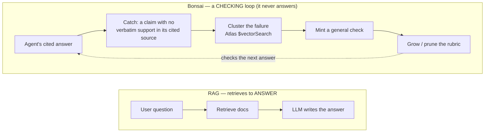
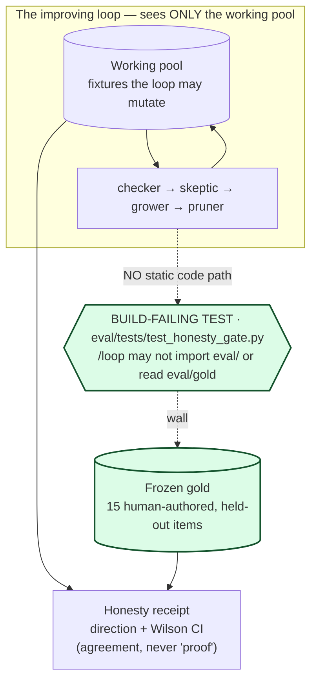
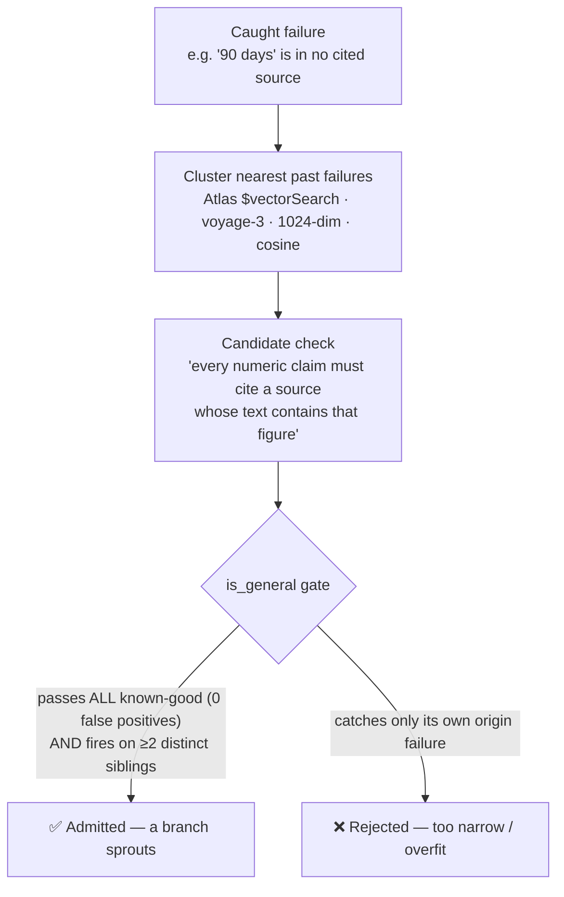
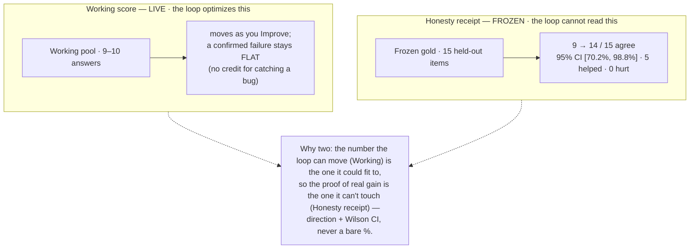
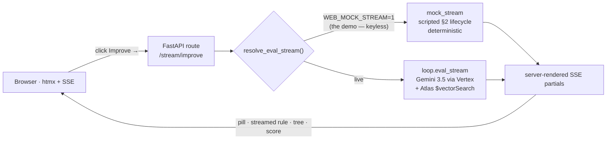

# 🌳 Bonsai — diagrams for the hard questions

Pull this up when a judge asks. Each diagram answers one of the questions from our
[Q&A pre-mortem], and every claim here is grounded in code (file refs given) and mirrors the
careful framing in [`README.md`](README.md). Two rules we never break: **gold *agrees*, it
never *proves*** — and we report **direction + a Wilson CI, never a bare %**.

**One-breath moat:** Bonsai is a self-improving eval *harness* whose improvement loop is
*structurally walled off* from a frozen, human-authored gold box — so it can mint and grow its
own checks while we still honestly measure (direction + Wilson CI) whether it **agrees** with
human judgment.

---

## 1. "Isn't this just RAG?"

RAG retrieves context to **answer**. Bonsai never answers — it runs a **checking loop** over an
external agent's already-cited answers: catch the unsupported claim, cluster the failure, mint a
reusable check, grow the rubric. The vector store serves the *eval* loop; retrieval is not the product.

---

## 2. "What stops the loop overfitting to gold? Does gold *prove* honesty?" — **the moat**

The improving loop (`/loop`) has **no static code path** to the frozen gold set. A build-failing
test (`eval/tests/test_honesty_gate.py::test_loop_never_references_gold_or_eval`) scans `/loop`
source and fails CI if it ever contains `import eval`, `from eval`, `eval/gold`, or `load_gold`.
So there is no gradient for the loop to fit to. Gold doesn't *prove* honesty — it's a held-out
human reference the loop's improvement is measured to **agree with**.

> The honesty claim dies on a single leak, so it's enforced **in code, not by discipline**.

> **Frozen gold — what it is, and where it's going**
>
> **Today.** "Frozen gold" is a small (15-item), human-authored, held-out reference of correct/incorrect answers. The improving loop is *build-time-provably* unable to read it — a CI test fails the build if `/loop` ever touches `eval/gold`. It's used for one thing only: scoring whether the loop's self-improvement **agrees with human judgment** — reported as direction, counts, and a Wilson 95% CI, never a bare percentage. Agreement is not proof of honesty; it's an independent check the loop can't game.
>
> **Enterprise future state.** In production, each gold set is owned by a **domain contract owner** — the compliance lead, security reviewer, or legal/policy expert for that domain. The people accountable for "what good looks like" define the held-out truth; the harness autonomously grows the checks. Separation of powers: the **domain expert defines truth**, the **loop improves coverage**.

---

## 3. "How is a minted check *general*, not memorized?"

Every candidate check passes through the `is_general` gate (`loop/grower.py:72`,
`pos == len(known_good) and neg >= 2`): it must pass on **all** held-back known-good answers
(zero false positives) **and** fire on **≥2 distinct** clustered siblings — not just the one
failure it was born from. A check that only catches its own origin never enters the rubric.
**Generalization is a gate, not a hope.**

---

## 4. "n is tiny — why is the score meaningful? Why two scores?"

Two numbers, deliberately. The **Working score** is the live pool the loop optimizes — and a
confirmed failure stays *flat* (an honest harness gives no credit for catching a bug), so it's the
number the loop *could* game. The real proof is the **Honesty receipt** against frozen gold, which
the loop can't read — reported as **direction + a Wilson 95% CI**, never a bare percentage (small n
honestly admits wide intervals).

---

## 5. "What's real vs mocked? What happens when I click Improve?"

The whole loop is wired live — **Gemini 3.5 via Vertex** (agent-under-test *and* checker/grower)
over **live Atlas `$vectorSearch`** — and the app is **deployed on DigitalOcean**. For the demo we
run the **deterministic mock** (`WEB_MOCK_STREAM=1`): the *same* §2 lifecycle and DOM, scripted for
keyless, reliable, repeatable timing. Same code path the SSE UI renders either way.

> Why mock for the money-beat: deterministic, keyless, no network to hang on stage — the verdict,
> the streamed rule, the cluster, and the `is_general` gate are all real outputs, just frozen into
> fixtures. The deployed DigitalOcean URL runs this exact mock path.

---

### Never-say guardrails (kept straight in every answer)

| ❌ Don't say | ✅ Say |
|---|---|
| "The gold set proves honesty" | "Gold is the held-out human box our improvement *agrees with*" |
| A bare % ("92% accurate") | Direction + counts + **Wilson CI** |
| "It's basically RAG" | "It's an eval **harness** — a checking loop" |
| "The loop learns from gold" | "The loop never sees gold; it improves over the working pool" |
| "General because the model is smart" | "`is_general`: passes all known-good, fires on ≥2 distinct failures" |

[Q&A pre-mortem]: the 10 hardest questions + armor live in the project notes (`qa-prep.md`).
