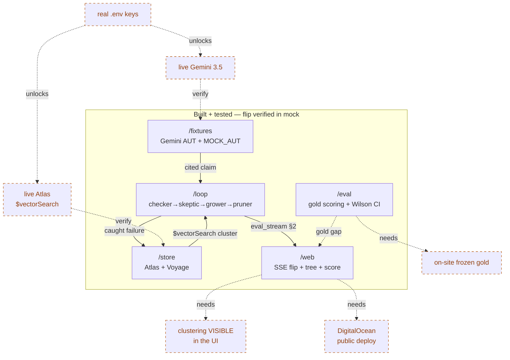
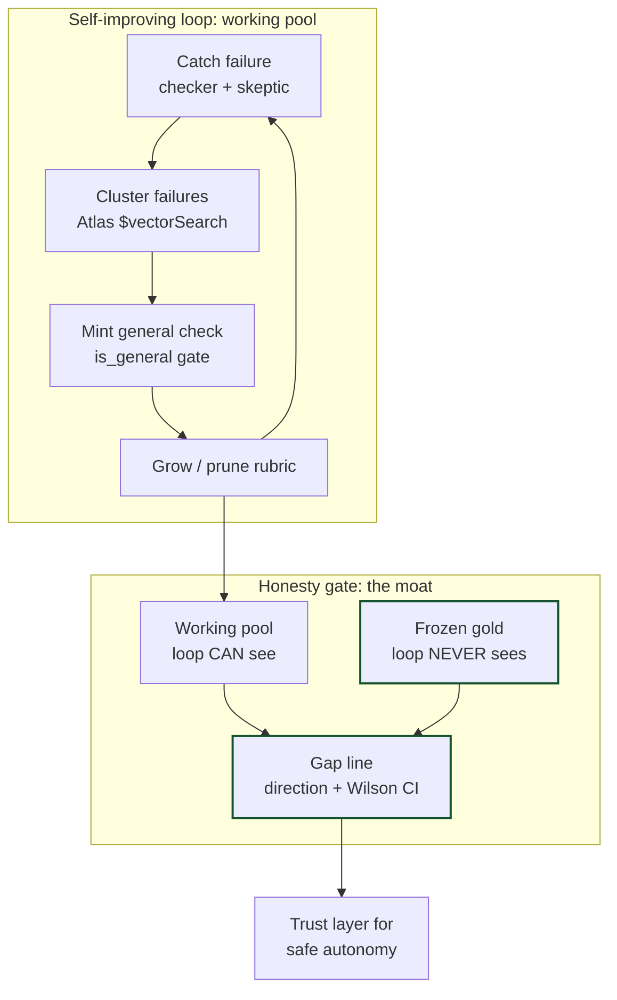

# 🌳 Bonsai

**A self-improving eval _harness_.** It watches an agent fail, mints a brand-new check to catch that failure forever, grows and prunes its own rubric — and proves it stayed honest against a frozen gold set the improving loop can never read.

> Built solo in 24h at the **AI Engineer World's Fair Hackathon 2026**.
> Not RAG. There's no retrieve-to-answer loop here — there's a *checking* loop.

---

## ▶️ See it in 30 seconds (no keys needed)

```bash
cd bonsai
python -m venv .venv && ./.venv/bin/pip install -r requirements.txt
WEB_MOCK_STREAM=1 MOCK_AUT=1 WEB_MOCK_DELAY=0.03 ./.venv/bin/uvicorn main:app --port 8000
```

Open **http://localhost:8000** → pick a **red** claim (a Gemini-3.5 cited answer whose number isn't actually in the source it cites) → click **Improve**:

```
🔴 red pill  →  🟡 CHECKING…  →  rule rewrites token-by-token  →  🌱 a branch sprouts  →  🟢 green
```

The agent's answer now passes a check that **didn't exist five seconds ago.** That's the whole product in one gesture.

---

## TL;DR

Evals are the bottleneck on safe autonomy: writing them is manual, they go stale, and nobody trusts them. **Bonsai is a self-improving eval harness** for cited-answer agents. It runs an agent-under-test (Gemini 3.5), catches claims that lack a verbatim supporting quote in their cited source, clusters those failures by embedding (MongoDB Atlas `$vectorSearch` over Voyage vectors), and **mints a new general check** for each kind of mistake — keeping it only if it passes *every* known-good answer and catches *≥2 distinct* sibling failures. It autonomously grows and prunes this rubric over a mutable working pool, then reports whether it actually improved as **direction + a Wilson confidence interval against a frozen, human-authored gold set the improving loop is build-time-provably unable to read.** It is a *harness* — a checking loop — not retrieval-augmented generation.

---

## 🛡️ The moat

Two things, and the second is the wedge:

1. **Autonomy.** The loop catches a failure → clusters siblings via Atlas Vector Search → mints a *general* check (`is_general` gate) → grows and prunes the rubric — all without a human in the loop, all over a **working pool**.
2. **A frozen-gold honesty gate.** The set the rubric is *scored against* is human-authored, frozen, and **architecturally unreadable by the improving loop**. `/loop` contains zero references to `/eval/gold` — and that's enforced by a test that **fails the build** if it ever does (`eval/tests/test_honesty_gate.py`).

That separation is the point. Lots of systems generate evals. Bonsai is the one that can **prove the improver didn't cheat** — because the improver and the judge are physically separated, and improvement is reported as a direction-plus-interval, never a bare percentage.

> **One-sentence novelty claim:** *To our knowledge, Bonsai is the first eval-generation system to make honesty a build-time architectural invariant — its autonomous, failure-clustered check-minting loop is provably unable to read the frozen gold set it is scored against, so every reported improvement is a direction-plus-confidence-interval against a judge the system cannot overfit to.*

Prior art generates evals (EvalGen, AutoChecklist, LangSmith Engine, ProbeLLM, Self-Harness). What's new here is *gating the generator* — see [`prior-art`](#prior-art--positioning) below.

---

## 🏗️ Architecture

### Current state — built & mock-green (solid), live path pending (dashed)



The whole spine is real, tested code and the flip runs **today in mock**. The dashed nodes are remaining *verification / visibility / deploy* work — not core function: wire real keys → confirm live Atlas `$vectorSearch` + live Gemini, surface clustering in the UI, deploy to DigitalOcean, author the frozen gold on-site.

### Target state — the self-improving loop + the moat



The loop autonomously catches failures, clusters them by embedding (Atlas `$vectorSearch`), mints *general* checks (`is_general`: passes all known-good, fails ≥2 cluster siblings), and grows/prunes the rubric — **all over the working pool.** The frozen gold set is a held-out box the rubric is *scored against* (agreement, never "proof"), reported as direction + Wilson CI. That separation — autonomy on one side, an untouchable honesty check on the other — is the moat.

**Modules** (seams frozen in [`CONTRACTS.md`](CONTRACTS.md)):

| Module | Role |
|---|---|
| `/fixtures` | The agent-under-test — a **Gemini 3.5** cited-answer agent, plus `MOCK_AUT` deterministic offline path |
| `/store` | Data layer — **MongoDB Atlas Vector Search** (`failvec`, 1024-dim cosine) + **Voyage** `voyage-3` embeddings |
| `/loop` | The eval engine — checker (det→Haiku→Opus) → skeptic → grower/minting → pruner → `eval_stream` SSE |
| `/eval` | Frozen-gold scoring — Wilson CI + paired sign-test; the honesty gate's test lives here |
| `/web` | The htmx + SSE flip UI — pill, token-streamed rule rewrite, bonsai-tree, score panel |

---

## 🚀 How to run

### Offline demo (deterministic, zero keys) — recommended for first look

```bash
WEB_MOCK_STREAM=1 MOCK_AUT=1 WEB_MOCK_DELAY=0.03 ./.venv/bin/uvicorn main:app --port 8000
```

### Live (real services)

1. Copy `.env.example` → `.env` and fill in:

   ```bash
   MONGODB_URI=mongodb+srv://…   # MongoDB Atlas (M0 free tier also supports Vector Search)
   VOYAGE_API_KEY=…              # voyageai.com — voyage-3, 1024-dim
   ANTHROPIC_API_KEY=…           # Opus 4.8 grower/judge · Haiku 4.5 checker
   GEMINI_API_KEY=…              # the agent-under-test
   MOCK_AUT=0                    # 0 = hit live Gemini 3.5 (default 1 = offline mock)
   ```

2. Install + run:

   ```bash
   ./.venv/bin/pip install -r requirements.txt
   MOCK_AUT=0 ./.venv/bin/uvicorn main:app --port 8000
   ```

   The Atlas `failvec` index is created programmatically by `store.ensure_index()` (1024, cosine) — no manual UI step. `GET /healthz` → `{"status":"ok"}`.

### Tests

```bash
./.venv/bin/pytest        # spine: checker→skeptic→grower→pruner→eval_stream + the honesty gate
```

---

## 🏆 Prize tech callouts

- **MongoDB Atlas Vector Search + Voyage** — the *engine*, not a sidecar. `store/vectors.py` runs real `$vectorSearch` over `voyage-3` 1024-dim embeddings; `nearest_failures()` clusters failures by *kind of mistake* (question + claim + diagnosis embedded together), which is exactly what makes a minted check **general** instead of overfit to one example.
- **Gemini 3.5** — the agent-under-test. `fixtures/gemini_client.py` calls `gemini-3.5-pro` to produce the cited answers Bonsai checks; every claim card is badged "Answered by Gemini 3.5" with its `[S#]` citations.
- **DigitalOcean App Platform** — deploy target. `deploy/app.yaml` + `deploy/Dockerfile` run `uvicorn main:app --timeout-keep-alive 75` with `/healthz` health checks and SSE that survives the 75s LB idle timeout.

---

## Prior art & positioning

The landscape is crowded — failure clustering, generality gating, automated check synthesis, and self-improving loops all have strong 2024–2026 prior art (EvalGen, AutoChecklist, LangSmith Engine, ProbeLLM, EvalAssist, GER-Eval). Novelty is argued at the level of **mechanism combination + enforcement**, not any single part. The defensible wedge: Bonsai is the only surveyed system that puts an **architectural honesty gate on the eval-generation pipeline itself** and reports improvement as **direction + confidence interval**. Full survey with adversarial verification, confidence levels, and the threats we pre-empt: see the prior-art writeup in the project notes.

**Honest framing we hold to:** the gold gate guarantees *the loop can't overfit to the judge* — it does **not** guarantee *the judge is complete*. We defend the former; we concede the latter.

---

## 🚫 Language we keep straight

- It's a **harness**, never "basic RAG."
- We report **before→after counts + a Wilson CI**, never a bare percentage (small n).
- The gold set **agrees with a human-authored reference** — it does not *prove* honesty. The honesty is the rail: `/loop` never reads `/eval/gold`, enforced by a build-failing test.
